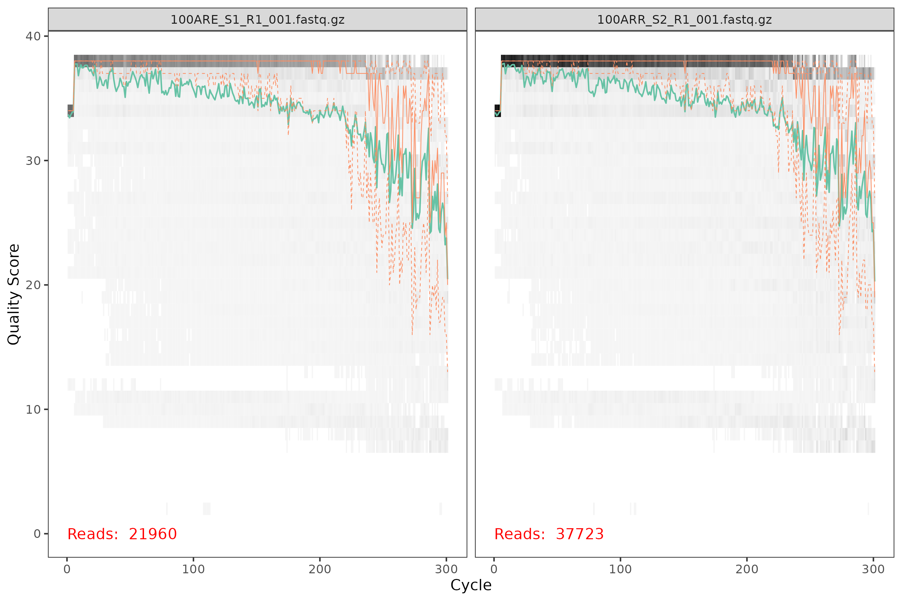
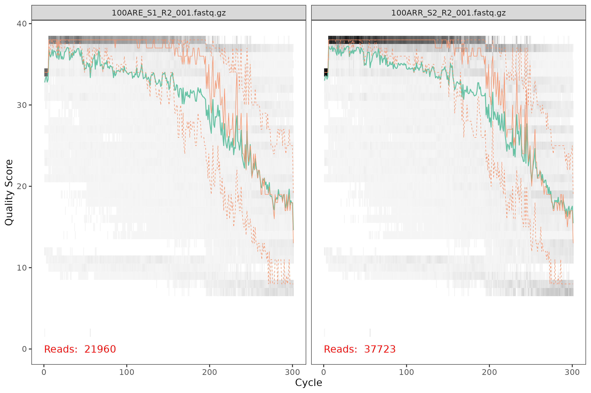
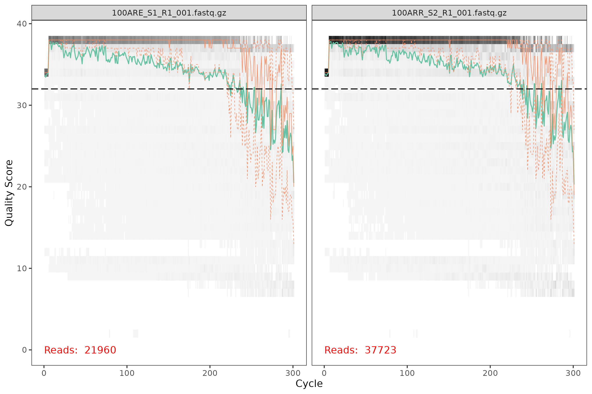
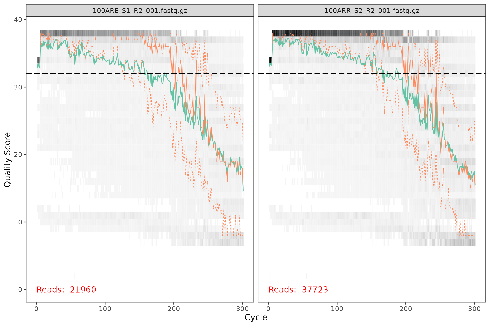

```{r setup, include=FALSE}
knitr::opts_chunk$set(echo = TRUE, eval = FALSE)
```

```{r, eval=TRUE}
library(data.table)
library(ggplot2)
```


## DADA2 for SINC

Microbiome research has shifted from using Operating Taxonomic Units (OTUs) to using Amplicon Sequence Variants (ASVs). Originally, OTUs were used to minimize error introduced by sequencers and because of the assumption that taxonomically similar variants of an organism would be minimally different. So OTUs are made by clustering similar observed sequences. Conversely, ASVs denoise sequences through modeling the error rate and avoid clustering altogether. This difference makes ASVs more specific (they identify a single unique sequence) and comparable across experiments (again due to being a unique sequence). In R we can generate ASV tables from fastq files using the `dada2` package.

This vignette will go over:

- where to find dada2 resources
- how to set up dada2 jobs on stargate
- an example dada2 script

## DADA2 Resources

The best place for in depth explanations of the `dada2` steps is in the [vignettes on bioconductor](https://bioconductor.org/packages/devel/bioc/vignettes/dada2/inst/doc/dada2-intro.html) which link to several papers with more details.

## Running DADA2 on stargate

The local data science cluster uses HT Condor to schedule jobs. You can submit a job to the cluster with a command like:

```
condor_submit dada2.submit
```

where `dada2.submit` is a text file similar to this:

```
####################
#
# Example Vanilla Universe Job
# Simple HTCondor submit description file
#
####################

name             = run_dada2
universe         = vanilla
getenv           = true
executable       = Rscript
arguments        = yourFile.R
log              = /home/yourUsername/path/to/logs/$(name).log
output           = /home/yourUsername/path/to/logs/$(name).out
error            = /home/yourUsername/path/to/logs/$(name).error
request_cpus     = 10
request_memory   = 40G
notification     = Always

##  Do not edit  ##
accounting_group=group_sinc
###################

queue
```

## Example DADA2 script

Here we go through an example dada2 script which would be provided to the submit file above in `arguments = yourFile.R`.


The dada2 script can stay the same between experiments with the exception of the truncation lengths, which should be picked using `plotQualityProfile`. 

```{r, eval = FALSE}
plotQualityProfile(c("100ARE_S1_R1_001.fastq.gz", "100ARR_S2_R1_001.fastq.gz")) # forward
plotQualityProfile(c("100ARE_S1_R2_001.fastq.gz", "100ARR_S2_R2_001.fastq.gz")) # reverse
```




In these plots we are looking for quality scores of at least 32, shown here.





Using those plots we can set the truncLength values for our dada2 script. You should check several sequences to inform this choice.

Apart from the truncation lengths you may also want to point to different taxonomic databases (pathToRDP, pathToSILVA, etc) than those shown here, but for SINC projects these are what we have been using.

Those changes would all be made in the `Args` section, the rest should work as is for your data.

```{r, eval = FALSE}
library(dada2)
library(stringr)
library(seqinr)

### Args
pathToSeq <- "/home/jsumner/SINC/field_2021/microbiome/sequences/field_samples"
pathToRDP <- "/home/jsumner/microbiome/Taxa/rdp_train_set_18.fa.gz"
pathToRDPSpec <- "/home/jsumner/microbiome/Taxa/rdp_species_assignment_18_withBart.fa.gz"
pathToSILVA <- "/home/jsumner/microbiome/Taxa/silva_nr99_v138.1_train_set.fa.gz"
pathToSILVASpec <- "/home/jsumner/microbiome/Taxa/silva_species_assignment_v138.1_withBart.fa.gz"
truncLength <- c(250, 175) # length after which to truncate forward and reverse reads, respectively
trimLeft <- 0
trimRight <- 0
cores <- 10 # this should be the number of cores specified in your submit file

### Housekeeping
samps <- unique(sub("_R\\d_.*", "", basename(list.files(pathToSeq, pattern = "*.fastq*"))))
samps <- samps[!grepl("^MM", samps)] # this was to remove samples from a different experiment
print(paste0("Detected ", length(samps), " samples for processing"))
fnFs <- sort(list.files(pathToSeq, pattern = "_R1_001.fastq", full.names = TRUE))
fnRs <- sort(list.files(pathToSeq, pattern = "_R2_001.fastq", full.names = TRUE))
filtFs <- file.path(pathToSeq, "filtered", paste0(samps, "_F_filt.fastq.gz"))
filtRs <- file.path(pathToSeq, "filtered", paste0(samps, "_R_filt.fastq.gz"))
names(filtFs) <- samps
names(filtRs) <- samps

### Filter and trimming
print("Filtering and trimming")
out <- filterAndTrim(fnFs, filtFs, fnRs, filtRs,
  truncLen = truncLength, trimLeft = trimLeft, trimRight = trimRight,
  maxN = 0, maxEE = c(2, 2), truncQ = 2, rm.phix = TRUE,
  compress = TRUE, multithread = cores
)

### Learning error rates
print("Learning error rates")
errF <- learnErrors(filtFs, multithread = cores)
errR <- learnErrors(filtRs, multithread = cores)

### Identifying unique sequences
print("Identifying unique sequences")
dadaFs <- dada(filtFs, err = errF, multithread = cores)
dadaRs <- dada(filtRs, err = errR, multithread = cores)

### Merging reads
print("Merging reads")
mergers <- mergePairs(dadaFs, filtFs, dadaRs, filtRs, verbose = cores)

### Generate ASV table
print("Generate ASV table")
seqtab <- makeSequenceTable(mergers)

### Removing Chimeras
print("Removing Chimeras")
seqtab.nochim <- removeBimeraDenovo(seqtab, method = "consensus", multithread = cores)
seqtab.print <- seqtab.nochim
colnames(seqtab.print) <- paste0("ASV", seq_len(length(colnames(seqtab.print))))
write.csv(seqtab.print, "dada2_asv_table.csv", quote = FALSE)

### Track sequences
print("Tracking sequences")
getN <- function(x) sum(getUniques(x))
track <- cbind(
  out, sapply(dadaFs, getN),
  sapply(dadaRs, getN),
  sapply(mergers, getN),
  rowSums(seqtab.nochim)
)
colnames(track) <- c("input", "filtered", "denoisedF", "denoisedR", "merged", "nonchim")
rownames(track) <- samps
write.csv(track, "dada2_sequence_tracking.csv", row.names = TRUE, quote = FALSE)

### Generate fasta file
print("Generate fasta file")
asvseq <- colnames(seqtab.nochim)
write.fasta(
  sequences = lapply(asvseq, identity),
  names = paste0("ASV", seq_len(length(asvseq))),
  file.out = "dada2_asv.fasta"
)

### Assign taxonomy
print("Assigning taxonomy")
taxa_rdp <- assignTaxonomy(seqtab.nochim, pathToRDP, multithread = cores)
taxa_rdp <- addSpecies(taxa_rdp, pathToRDPSpec)
rownames(taxa_rdp) <- paste0("ASV", seq_len(length(asvseq)))
write.csv(taxa_rdp, "dada2_rdp_taxonomy.csv", quote = FALSE)
taxa_silva <- assignTaxonomy(seqtab.nochim, pathToSILVA, multithread = cores)
taxa_silva <- addSpecies(taxa_silva, pathToSILVASpec)
rownames(taxa_silva) <- paste0("ASV", seq_len(length(asvseq)))
write.csv(taxa_silva, "dada2_silva_taxonomy.csv", quote = FALSE)

### Save everything in RData
print("Creating RData Object")
save(fnFs, fnRs, samps, filtFs, filtRs, out, errF, errR, dadaFs, dadaRs,
  mergers, seqtab, seqtab.nochim, track, seqtab.print,
  asvseq, taxa_rdp, taxa_silva,
  file = "dada2_output.RData"
)
print("Done!")
```


## Tracking DADA2

While the job is running on stargate you can monitor the log files and use `condor_fullstat | grep yourUsername` to see your job's usage and `condor_chart {cpu or mem or disk} yourJobPID` where your job PID is found from `condor_fullstat`. 

When the job is done running you can check the progress using the `track` object in the `dada2_output` rdata (which is the same as the `dada2_sequence_tracking.csv` file). That will show you where your data are being filtered the most and allow you to compare trends between experiments if that is of interest.

```{r, eval = TRUE, echo = FALSE}
track <- structure(list(id = c(1L, 2L, 3L, 4L, 5L, 6L, 1L, 2L, 3L, 4L, 
5L, 6L, 1L, 2L, 3L, 4L, 5L, 6L, 1L, 2L, 3L, 4L, 5L, 6L, 1L, 2L, 
3L, 4L, 5L, 6L), sample = c("100ARE", "100ARR", "100AS", "100BRE", 
"100BRR", "100BS", "100ARE", "100ARR", "100AS", "100BRE", "100BRR", 
"100BS", "100ARE", "100ARR", "100AS", "100BRE", "100BRR", "100BS", 
"100ARE", "100ARR", "100AS", "100BRE", "100BRR", "100BS", "100ARE", 
"100ARR", "100AS", "100BRE", "100BRR", "100BS"), tissue = c("ARE", 
"ARR", "AS", "BRE", "BRR", "BS", "ARE", "ARR", "AS", "BRE", "BRR", 
"BS", "ARE", "ARR", "AS", "BRE", "BRR", "BS", "ARE", "ARR", "AS", 
"BRE", "BRR", "BS", "ARE", "ARR", "AS", "BRE", "BRR", "BS"), 
    depth = c("A", "A", "A", "B", "B", "B", "A", "A", "A", "B", 
    "B", "B", "A", "A", "A", "B", "B", "B", "A", "A", "A", "B", 
    "B", "B", "A", "A", "A", "B", "B", "B"), tiss = c("RE", "RR", 
    "S", "RE", "RR", "S", "RE", "RR", "S", "RE", "RR", "S", "RE", 
    "RR", "S", "RE", "RR", "S", "RE", "RR", "S", "RE", "RR", 
    "S", "RE", "RR", "S", "RE", "RR", "S"), variable = structure(c(1L, 
    1L, 1L, 1L, 1L, 1L, 2L, 2L, 2L, 2L, 2L, 2L, 3L, 3L, 3L, 3L, 
    3L, 3L, 4L, 4L, 4L, 4L, 4L, 4L, 5L, 5L, 5L, 5L, 5L, 5L), levels = c("input", 
    "filtered", "denoisedF", "denoisedR", "merged", "nonchim"
    ), class = "factor"), value = c(21960, 37723, 40306, 30558, 
    47596, 39143, 15803, 28054, 28611, 21285, 34732, 27402, 15461, 
    24742, 24445, 21086, 30951, 23604, 15494, 26192, 27039, 21141, 
    32609, 25535, 8388, 14802, 12895, 9303, 19101, 13816), name = structure(c(1L, 
    1L, 1L, 1L, 1L, 1L, 2L, 2L, 2L, 2L, 2L, 2L, 3L, 3L, 3L, 3L, 
    3L, 3L, 4L, 4L, 4L, 4L, 4L, 4L, 5L, 5L, 5L, 5L, 5L, 5L), levels = c("input", 
    "filtered", "denoisedF", "denoisedR", "merged", "nonchim"
    ), class = c("ordered", "factor"))), row.names = c(NA, 30L
), class = c("data.frame"))
```


```{r, eval=TRUE}
ggplot(track, aes(x = variable, y = value, group = id, color = interaction(depth, tiss))) +
  facet_grid(depth ~ tiss, scale = "free") +
  geom_line(alpha = 0.75, linewidth = 0.25, show.legend = FALSE) +
  labs(y = "Reads", title = "DADA2 - Reads") +
  theme_minimal() +
  theme(
    axis.text.x.bottom = element_text(angle = -45, hjust = 0),
    axis.title.x.bottom = element_blank(),
    strip.background = element_rect(fill = "gray50", color = "gray20"),
    strip.text.x = element_text(size = 14, color = "white"),
    strip.text.y = element_text(size = 14, color = "white")
  )
```


